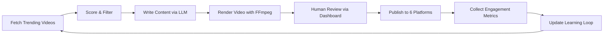

# Architecture

GenLab is a video-first content automation platform organized as a Python monorepo.

## Layers

```
Layer 1 — genlab-core/        Shared infrastructure (never changes per niche)
Layer 2 — <Channel>/strategies/  Pluggable strategies (abstract interfaces per niche)
Layer 3 — <Channel>/config/     Niche configuration (pure YAML)
```

## Packages

| Package | Purpose |
|---------|---------|
| `genlab-core` | Shared library: pipeline runner, platform clients, learning loop, engagement engine, video compositor |
| `BlackboxBrief` | AI/Tech news channel (niche_id: `ai_creators`) |
| `CriticalRush` | Gaming channel (niche_id: `gaming`) |
| `ClutchWire` | Sports channel (niche_id: `sports`) |
| `SpliceReel` | Movies channel (niche_id: `movies`) |
| `FrameDrift` | Anime channel (niche_id: `anime`) |
| `dashboard` | Operations dashboard (React + Flask) |

## Pipeline



## Key Design Decisions

- **Video-only**: No text posts, carousels, or static images. Every piece of content is a video reel.
- **Config-driven niches**: Adding a new channel requires ~200 lines of strategy code + YAML config. No shared code changes.
- **Learning loop**: LinUCB contextual bandit with 6D features optimizes content selection based on engagement feedback.
- **Engagement engine**: Hybrid auto-reply system with toxicity filtering and rate limiting per platform.
- **Learning-engine layer (shipped 2026-06-26, PRs #604-#608)**: 5 engines running alongside the LinUCB loop — critique-rewriter (PR #604), conformal router (PR #605), hook diversity penalty (PR #606), click-rationale classifier (PR #607), Bayesian LR gate (PR #608). All gated behind `GENLAB_*_ENABLED` flags; each engine returns defaults until its per-niche calibration sample count crosses threshold (~50 rows). Refit timers + nightly drift detector (PRs #609, #614) keep them honest.
- **AUTO #1 / AUTO #2 calibration trilogy**: three-stage path to autonomous publishing — AUTO #1 (observation-only gate, shipped 2026-06-13) decides+logs every operator click; calibration logger writes `auto_approval_calibration` rows; AUTO #2 (enforcement worker, PR #462) flips on per-niche once `≥30 samples AND ≥90% agreement`. `ai_creators` currently at 10% rollout (96.4% agreement, calibration-ready); other niches still observation-only.

## Deployment

Production runs on a Hetzner cloud server:
- PostgreSQL + Redis in Docker
- All Python services via systemd (6 always-on + **40+ timers** (mapped during 2026-06-25 audit) — pg-backup, rls-drift-check, niche-pause-sweeper, compliance-digest-sender, refit timers, nightly drift detector, etc.)
- Caddy reverse proxy with Cloudflare HTTPS
- 50GB Hetzner Volume for media storage

## Testing

```bash
# All tests
uv run --package genlab-core pytest genlab-core/tests/ -x

# Specific channel
uv run --package criticalrush pytest CriticalRush/tests/ -x
```

261 test files across 7 packages.
